# Workout Tracker App

A gym tracker which lets you log your entire workouts (exercises, sets, reps, etc) and also it logs your cardio sessions.
It tracks your PRs (Personal Records) and notifies you when a PR achieved. 
It also lets you log your sleep and body measurements for further analytics and progress tracking.

## Tech Stack
- Flutter
- Dart
- Firebase Authentication
- Firebase Firestore

## Features
- Workout logging
- PR tracking
- Cardio tracking
- Sleep tracking
- Real-time Firestore updates

## Screenshots

### Home Screen
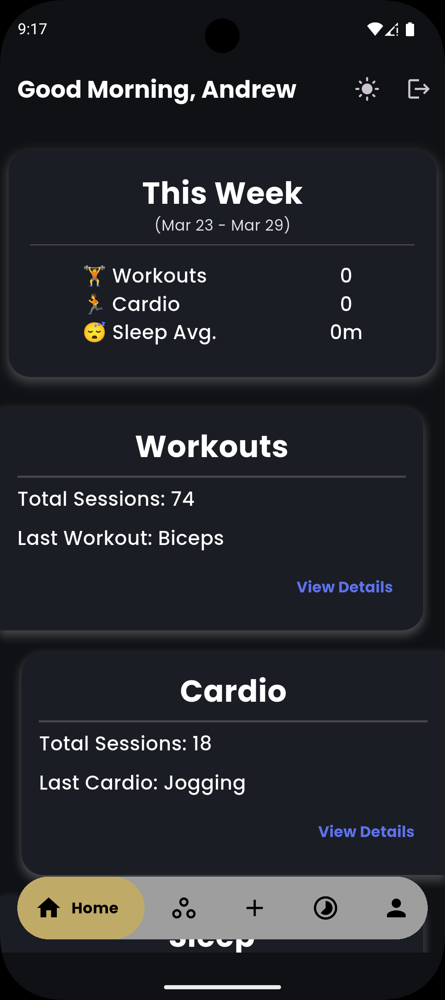
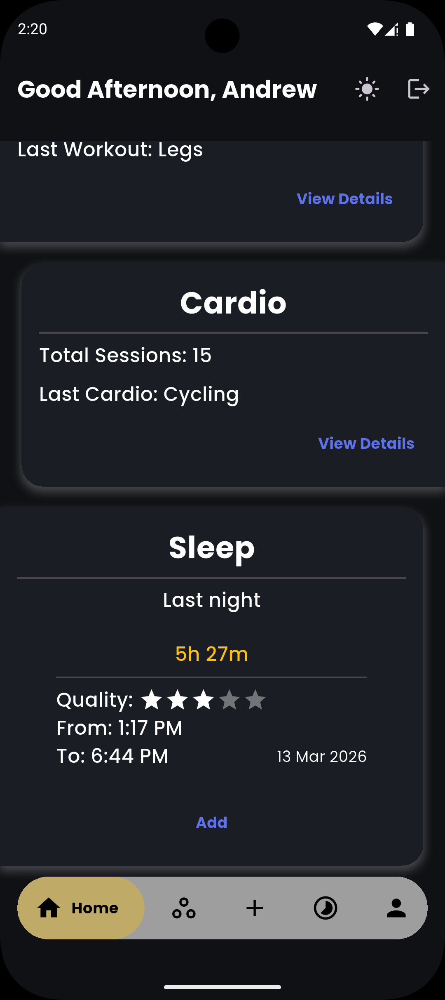

### Stats Screen
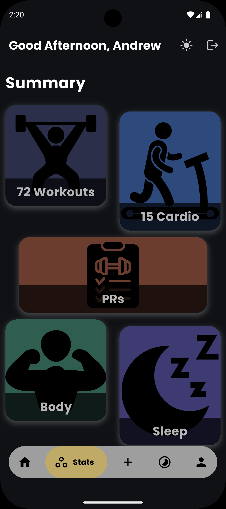

### Start Screen
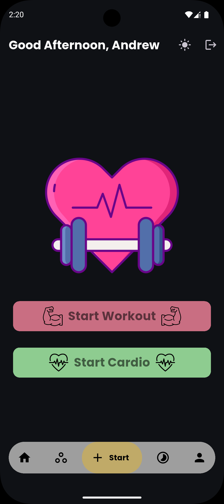
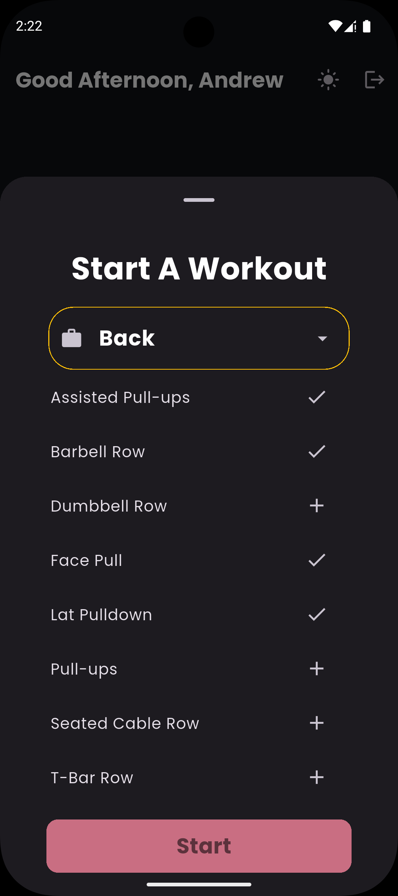

### Current Screen
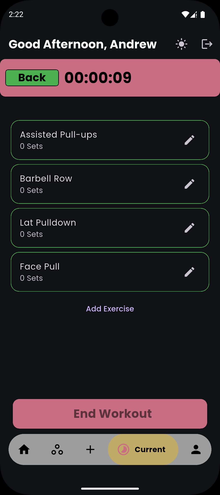
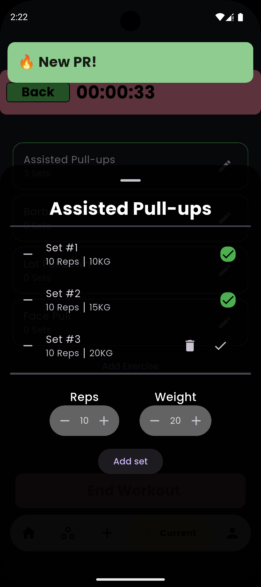
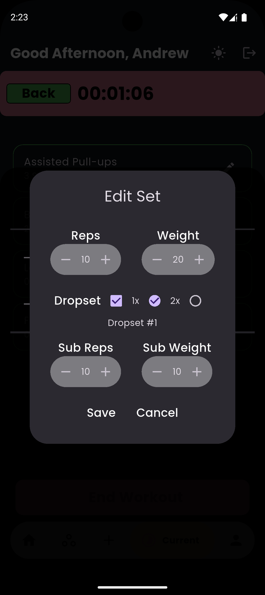

### Profile Screen
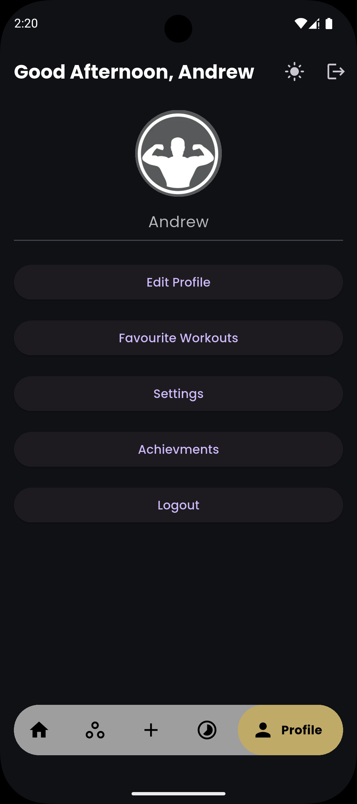

### Personal Records Screen
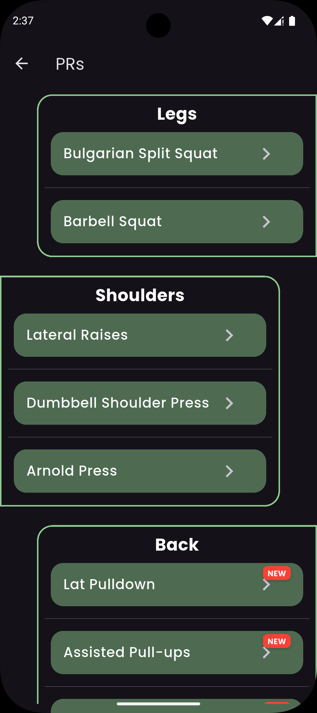
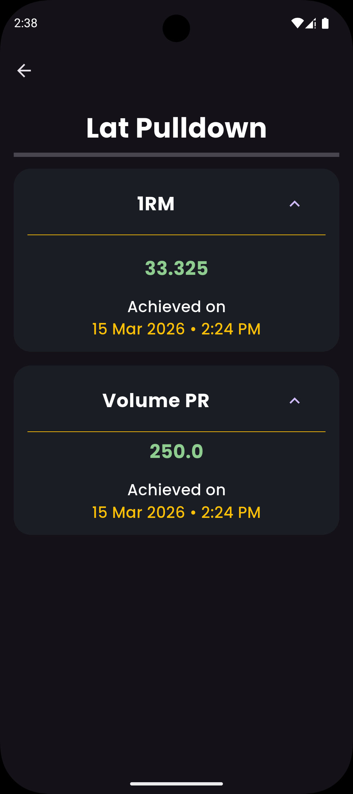

### Sleep Screen
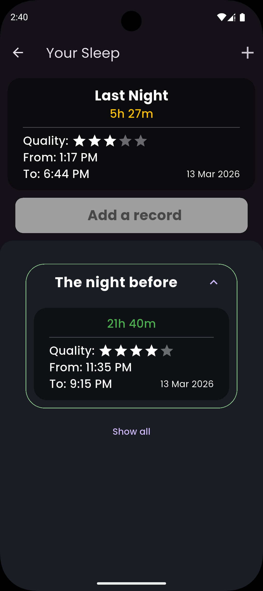
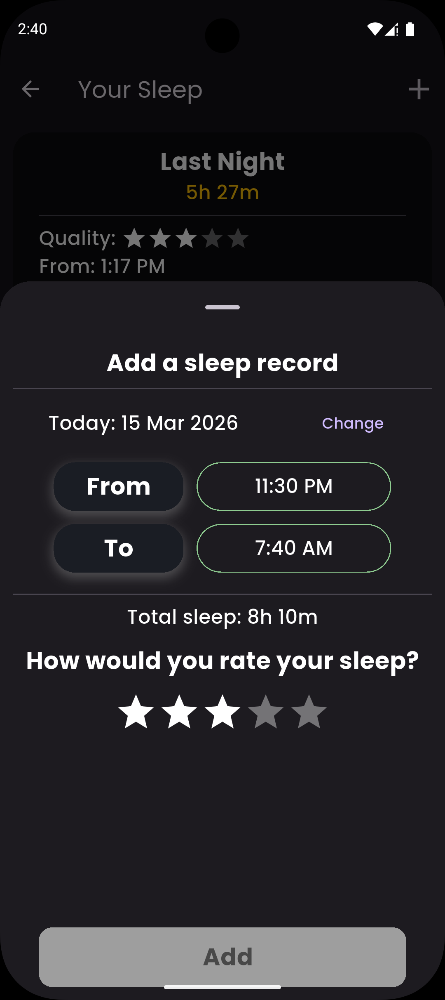

## Future Improvements
- Workout program generator
- Progress charts

## Author
Andrew Fathy
